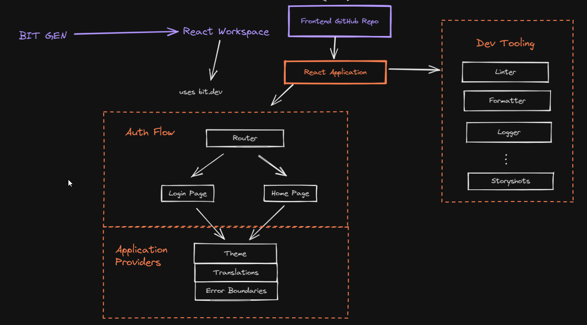
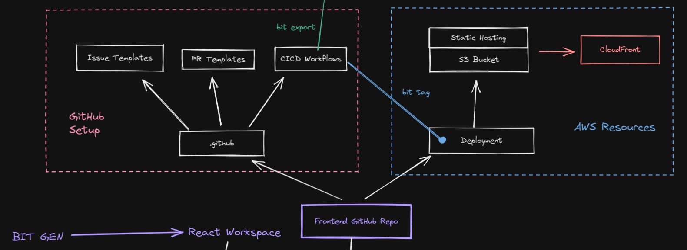
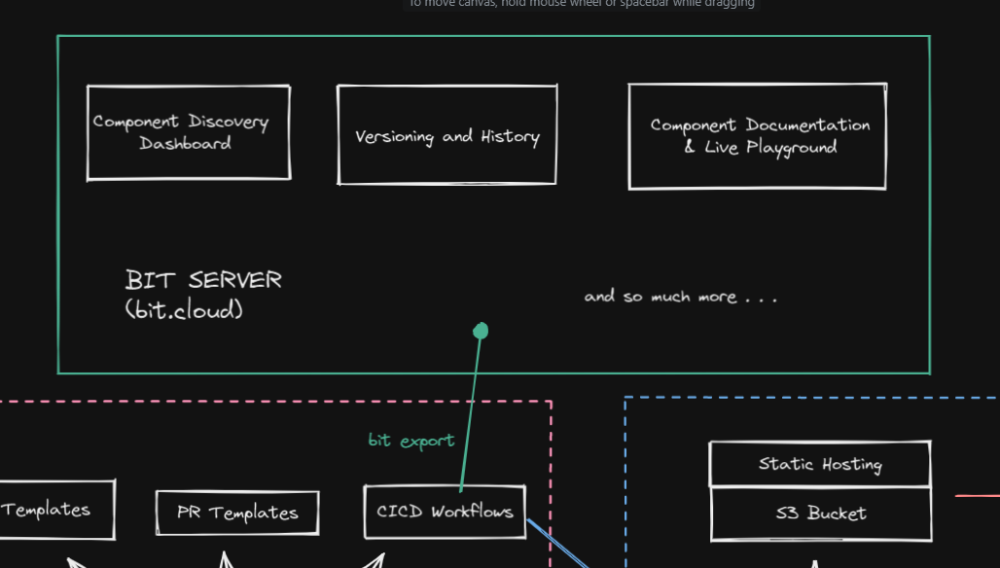

# Bit Gen

Internal Demo: https://drive.google.com/file/d/1BLP-4sI1JVebuZ-V5GkJkgUNQ2ydPRhc/view?usp=sharing

## What is BitGen?

BitGen is a generator that creates an opinionated, batteries-included bit workspace for building atomic frontends. Why Atomic? The workspace prescribes a pattern of building an application with principles from [Atomic Design](https://www.youtube.com/watch?v=Yi-A20x2dcA).

A BitGen workspace has a React application (basic auth flow) out of the box with all the necessary dev tooling like linting, formatting, automated snapshot testing with storyshots etc.



Building react applications with bit is "THE" most scalable way of building react applications imo.
Read more about bit [here](https://bit.dev/)

The React application created by BitGen also has built-in GitHub management tooling like tried-and-tested issue templates, PR templates and CICD workflows that handle publishing of components and releases with test, lint and format pipelines. Published components get pushed to your configured bit.cloud server. BitGen also allows for easy setup of S3, CDN deployment so that you can have an end-to-end deployed app from day 1.



Components that are published to your bit server can be accessed via the [bit cloud website](https://bit.cloud/). The bit.cloud website has features that enable component discovery, versioning, and component documentation.



## Example components published using BitGen

[Looper Bit Cloud](https://bit.cloud/ashwanth1109/looper) | [Looper GitHub](https://github.com/ashwanth1109/looper)

## Create Workspace

To create a new workspace with this template, run the following command:

```shell
bit new bitgen <new-workspace-name> --aspect ashwanth1109.looper/generators/react-wkspc
# Example
bit new bitgen test-wkspc --aspect ashwanth1109.looper/generators/react-wkspc
```

## What's included

- ### **workspace.jsonc**

This is the main configuration file of your bit workspace. Here you can modify the workspace name and icon as well as default directory and scope. It is where dependencies are found when you install anything. It is also where you register aspects, bit extensions as well as apply the environments for your components. This workspace has been setup so that all components use the React env. However you can create other components and apply other envs to them such as node, html, angular and aspect envs.

- ### **.bitmap**

This is an auto-generated file and includes the mapping of your components. There is one component included here. In order to remove this component you can run the following command.

- ### **.gitignore**

Ignoring any files from version control

- ### **start.sh**

Script to start your server.

```shell
chmod +x start.sh
./start.sh
```

- ### **generators/react-comp**

Your newly created workspace has the `react-comp` component template available out of the box.
You can see this template using the following command:

```shell
bit templates
# You should see "react-comp (bit-gen component template)" in the list
```

To create a new react component using the bit-gen standard, run the following command:

```shell
bit create react-comp ui/button
```

- ### **.storybook**

This is the configuration required for storybook to run.
It also installs other add-ons required by the stories.

To start your storybook server

```shell
pnpm story
```

- ### **.eslintrc.js**

ESLint configuration that the workspace uses.

To lint your components, run the following command:

```shell
pnpm lint
```

- ### **.prettierrc.js** and **.prettierignore**

Prettier configuration that the workspace uses

To format your components, run the following command:

```shell
pnpm format

# to check format status
pnpm format:check
```

- ### **remote/storyshots/index.spec.ts**

Storyshots configuration to auto generate snapshots (snapshot testing) for your stories.
Along with jest testing for any other spec files you may contain.

```shell
pnpm test
pnpm test:watch # in watch mode
```

- ### **.github**

CICD comes out of the box with bitgen.
However, you need to set your BIT_TOKEN. To get the value for this, you need to login and get the config

```shell
bit login
bit config get user.token
```

Once you have this value, create a GitHub secret called "BIT_TOKEN".
